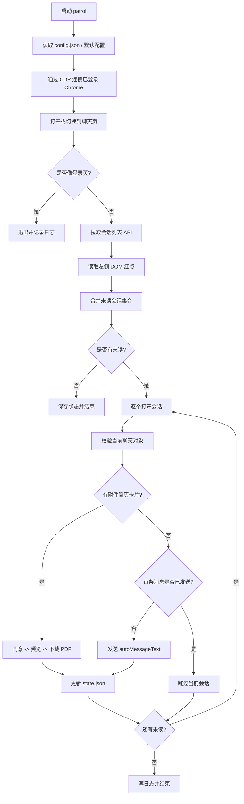
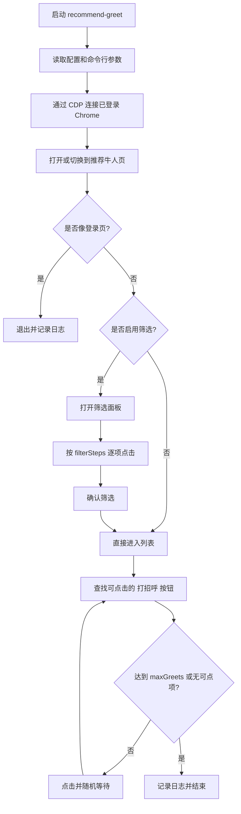
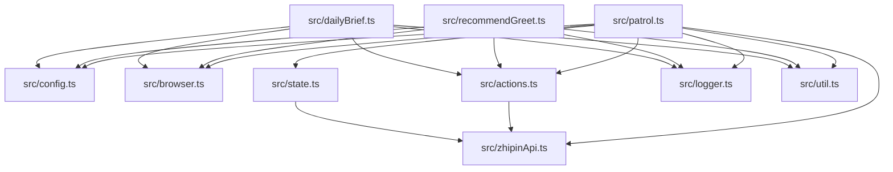

# Boss Assistant

基于 Playwright + Chrome CDP 的 Boss 直聘网页端自动化工具集。它复用你已经登录的 Chrome，会执行两类重复性操作：

- `patrol`：巡检聊天页未读会话，自动发送首条消息，或处理“发送附件简历”消息卡并下载 PDF
- `recommend-greet`：进入推荐牛人页，按配置筛选后批量点击“打招呼”
- `daily-brief`：拉取候选人、获取简历、AI 汇总分析并创建飞书云文档，生成初筛匹配度报告

> 仅用于你已授权的招聘流程。请遵守平台规则，控制执行频率，并始终在有人值守的前提下使用。

## 项目能做什么

### 1. 聊天巡检 `npm run patrol`

- 连接到已登录的 Chrome
- 打开 Boss 直聘聊天页
- 通过 `wapi` 会话列表和左侧 DOM 红点共同识别未读会话
- 逐个打开未读会话并校验当前聊天对象，避免误发
- 如果出现“对方想发送附件简历”卡片：
  - 点击同意
  - 点击预览
  - 下载 PDF
  - 关闭弹窗
- 如果没有附件卡片，且该会话还没发过首条消息：
  - 发送配置中的 `autoMessageText`
- 将处理状态写入 `data/state.json`

### 3. 每日简历 Brief `npm run daily-brief`

- 拉取今天的 Boss直聘 候选人列表
- 批量获取候选人简历信息
- AI 汇总分析，按职位分组整理为 Markdown 格式
- 创建飞书云文档，存储分析结果
- 生成初筛匹配度报告，采用四段式评估模型：
  - 硬性门槛：学历、年限、必须经验、排除项
  - 核心匹配度：岗位能力、项目场景、技能关键词、成果证明
  - 背景竞争力：学历学校、公司平台、职级职责、项目复杂度
  - 稳定性与风险：在职时长、跳槽频率、经历连续性、信息完整度
- 自动发索要简历消息，对合适的候选人发送消息
- 操作记录归档，将结果记录到飞书文档中

## 整体流程图

### `patrol` 执行链路



### `recommend-greet` 执行链路



## 模块关系



### 模块职责说明

- `src/patrol.ts`
  - 聊天巡检主入口
  - 编排“识别未读 -> 打开会话 -> 下载简历或发消息 -> 记录状态”整条流程
- `src/recommendGreet.ts`
  - 推荐页批量打招呼入口
  - 负责编排筛选、点击和滚动逻辑
- `src/actions.ts`
  - 页面交互动作层
  - 包含打开会话、身份校验、处理附件卡片、发送消息等操作
- `src/zhipinApi.ts`
  - 会话列表读取与未读识别逻辑
  - 负责 `wapi` 探测、字段兼容、DOM 红点匹配
- `src/browser.ts`
  - Chrome CDP 连接与页面切换
  - 负责复用已登录浏览器上下文
- `src/config.ts`
  - 默认配置与 `config.json` 合并
- `src/state.ts`
  - 运行状态持久化
  - 用于记录某个会话是否发过消息、是否接收过简历
- `src/logger.ts`
  - 生成按时间切分的日志文件，同时输出到控制台
- `src/types.ts`
  - 类型定义
- `src/util.ts`
  - 通用小工具，目前主要提供 `sleep`
- `scripts/install-task.ps1`
  - 在 Windows 注册计划任务，按固定间隔执行 `patrol`
- `scripts/uninstall-task.ps1`
  - 卸载对应计划任务
- `SKILL.md`
  - 给 AI 助手用的项目执行约束与操作规范
- `SKILL-recommend-greet.md`
  - 推荐页打招呼任务的补充说明
- `SKILL-daily-brief.md`
  - 每日简历 Brief 任务的详细说明，包含初筛匹配度报告的评估模型
- `references/`
  - 规则、接口和实现备忘

## 环境要求

- Node.js `>= 20`
- Chrome
- 你已经手动登录 Boss 直聘网页端
- Chrome 以远程调试模式启动

## 快速开始

### 1. 安装依赖

```bash
npm install
```

### 2. 启动带 CDP 的 Chrome

Windows 示例：

```powershell
& "C:\Program Files\Google\Chrome\Application\chrome.exe" `
  --remote-debugging-port=9222 `
  --user-data-dir="C:\boss-assistant\chrome-profile" `
  --new-window "https://www.zhipin.com/web/chat/index"
```

### 3. 复制配置

```bash
copy config.example.json config.json
```

### 4. 执行任务

```bash
npm run patrol
npm run recommend-greet
npm run daily-brief
```

## 常用命令

```bash
# 聊天巡检
npm run patrol

# 推荐页最多打 30 个招呼
npm run recommend-greet -- --max=30

# 跳过筛选，直接对当前列表打招呼
npm run recommend-greet -- --no-filters

# 执行每日简历 Brief
npm run daily-brief
```

## 配置说明

请参考 `config.example.json`。常用字段如下：

- `chatUrl`
  - 聊天页地址
- `pdfDir`
  - 下载的附件简历 PDF 保存目录
- `cdpUrl`
  - Chrome CDP 地址，默认 `http://127.0.0.1:9222`
- `statePath`
  - 状态文件路径
- `logDir`
  - 日志目录
- `autoMessageText`
  - 首条自动沟通话术
- `friendListApiCandidates`
  - 会话列表 API 候选地址
- `textPatterns`
  - 页面文案匹配规则，包含登录页、附件卡片、预览按钮等关键文案
- `recommendGreet.maxGreets`
  - 本轮推荐页最多点击多少次“打招呼”
- `recommendGreet.applyFilters`
  - 是否执行筛选步骤
- `recommendGreet.filterSteps`
  - 推荐页筛选步骤，按顺序执行

## 运行产物

- 巡检日志：`data/logs/patrol-*.log`
- 推荐页日志：`data/logs/recommend-greet-*.log`
- 状态文件：`data/state.json`

## 调试方法

### 调试会话列表识别

```cmd
set BOSS_DEBUG_FRIEND=1
npm run patrol
```

重点看日志中的这些字段：

- `DEBUG wapi`
  - 每个候选接口的 HTTP 状态、业务码和返回数组长度
- `DEBUG DOM`
  - 左侧红点匹配情况
- `开始处理会话`
  - 当前会话处理进度
- `身份校验未通过`
  - 打开会话后读到的人名和预期不一致

### 调试推荐页

```bash
npm run recommend-greet -- --max=10
```

重点看：

- 是否成功打开筛选面板
- 是否能找到“打招呼”按钮
- 列表多次滚动后是否还有可点击项

## Windows 中文乱码说明

这个仓库中的文档和源码统一按 UTF-8 保存。如果你在 Windows 终端里看到中文乱码，通常是终端输出编码不是 UTF-8，而不是文件内容损坏。

PowerShell 可先执行：

```powershell
[Console]::InputEncoding = [System.Text.UTF8Encoding]::new()
[Console]::OutputEncoding = [System.Text.UTF8Encoding]::new()
chcp 65001 > $null
```

如果你使用 VS Code，建议确认：

- 文件编码为 UTF-8
- 终端使用 UTF-8
- 不要把仓库文件另存为 ANSI / GBK

## 计划任务

安装巡检计划任务：

```powershell
.\scripts\install-task.ps1
```

卸载计划任务：

```powershell
.\scripts\uninstall-task.ps1
```

当前计划任务名称为 `BossAssistantPatrol`，默认每 6 小时执行一次 `patrol`。

## 目录结构

```text
boss assistant/
├─ config.example.json
├─ config.json
├─ data/
├─ references/
├─ scripts/
├─ src/
│  ├─ actions.ts
│  ├─ browser.ts
│  ├─ config.ts
│  ├─ logger.ts
│  ├─ patrol.ts
│  ├─ recommendGreet.ts
│  ├─ state.ts
│  ├─ types.ts
│  ├─ util.ts
│  └─ zhipinApi.ts
├─ SKILL.md
├─ SKILL-recommend-greet.md
└─ SKILL-daily-brief.md
```

## 维护建议

- 不要提交 `config.json`
- 不要提交 `data/` 目录中的运行产物
- 新增中文文档或源码文件时统一使用 UTF-8
- 如果平台页面结构变化，优先检查：
  - `src/actions.ts`
  - `src/zhipinApi.ts`
  - `config.json` 中的 `textPatterns`
